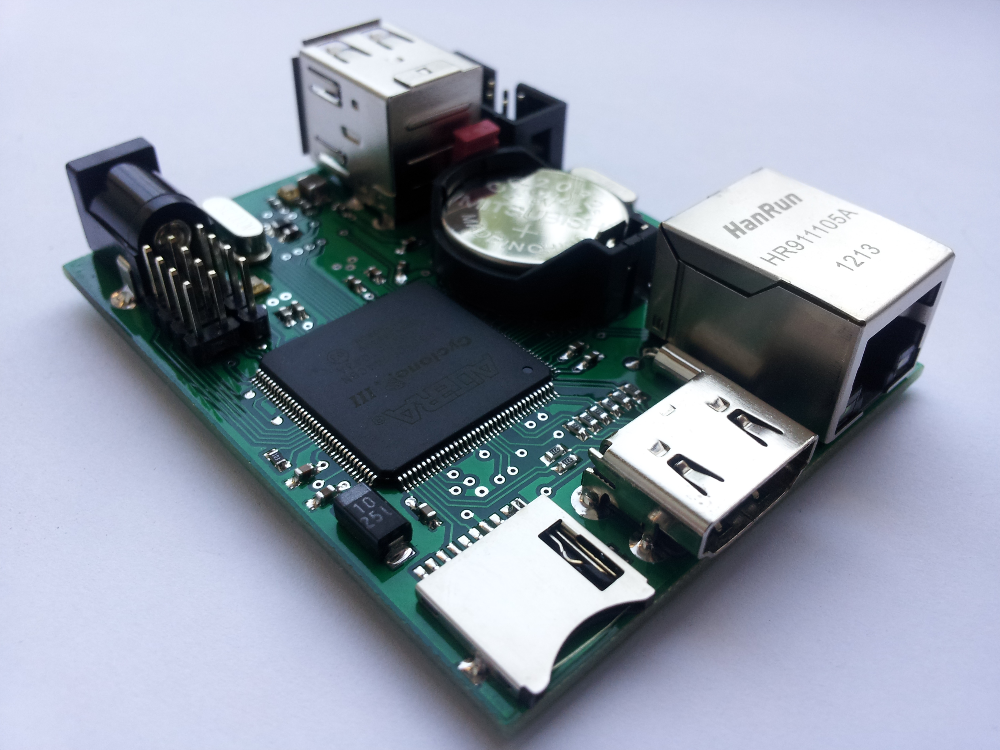
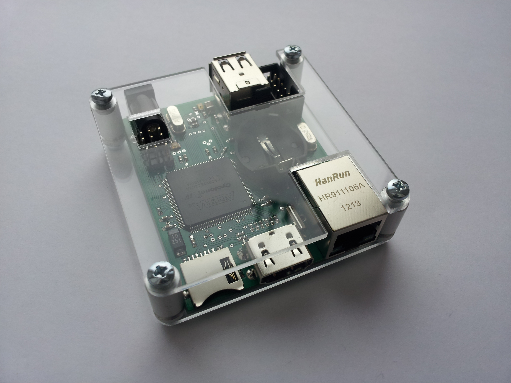

# Плата ReVerSE-U16 Rev.C

Плата ReVerSE-U16 ориентированна на создание SoC систем на микросхеме программируемой логики ПЛИС. Отлично подходит для домашнего обучения и позволяет полностью воссоздать множество ретро-компьютеров.
Для программирования используются программаторы и отладочные среды, позволяющие задать желаемую структуру цифрового устройства в виде принципиальной электрической схемы или программы на специальных языках описания аппаратуры: Verilog, VHDL, AHDL и др. В конфигурации ПЛИС реализуются почти все компоненты компьютера. Вне ПЛИС находятся только оперативная память, аппаратные интерфейсы для подключения клавиатуры, мыши, монитора, и других устройств.

####Спецификация:
- FPGA Cyclone IV EP4CE22E22C8N(7N) (supports Cyclone III EP3C5/10/16/25, Cyclone IV EP4CE6/10/15/22)
- SDRAM 16MB x 16 bit (supports 4/16/32MB x 16 bit)
- SPI FLASH 64Mb (supports 64/16/1Mb)
- RTC DS1338Z + CR2032
- HDMI for sound and video (DVI or HDMI Male to VGA HD-15 15Pin Male Adapter Cable Cord)
- 10/100 Base-T Ethernet interface controller ENC424J600 with integrated MAC & PHY
- Dual USB 2.0 Host / Slave controller VNC2 (2 x ports)
- micro SD
- JTAG
- GPIO IO=4, IN=4 (uBUS+)
- Power +5В 1A
- PCB Size 70 х 56 mm

Это финальная версия платы ReVerSE-U16. Исправлена и доработана разводка. Расширен интерфейс uBUS (GPIO IO=4, IN=4). Дополнительные сигнальные линии дают возможность увеличить скорость обмена преобразователя шины uBUS-ZXBUS, подключить различные платы расширения или устройства со SPI интерфейсом, к примеру - VS1053 - Ogg Vorbis / MP3 / AAC / WMA / FLAC / MIDI Audio Codec, графический контроллер FT800...

#### Вид платы в корпусе:

