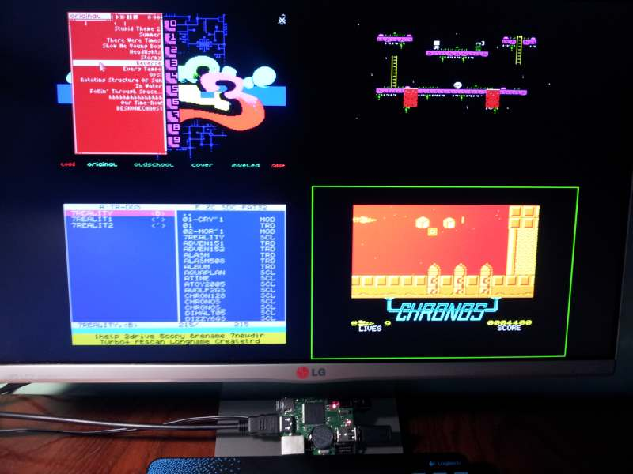
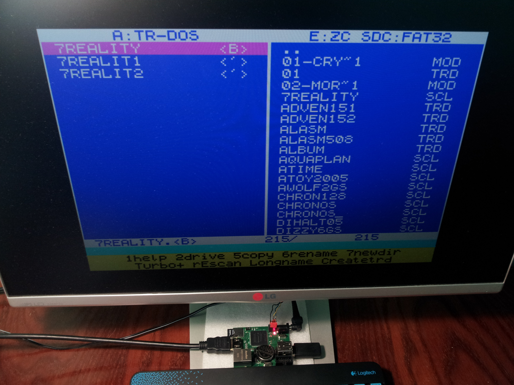

# Quad Speccy

Quad Speccy - это система "4 in 1", т.е. построена на базе 4-х совместимых ZX-Spectrum, работающих параллельно.

- 640x480@60Hz HDMI Audio 2Ch 32kHz
- F9=звук только в выбранном окне (по просьбе zaxon)

Используйте клавиши:

- F1-F4 = Выбор требуемого окна процессора для передачи управления от клавиатуры
- F5 = NMI
- F6 = DivMMC/Z-Controller
- F7 = SounDrive On
- F9 = Sound in Window/All
- F12 = CPU Reset
- PrtScr = Hard Reset
- Pause = Hard Reset всех процессоров
- Win = Full Window

Демонстрационное видео:

Поддержка проекта: http://zx-pk.ru/

Каждый совместимый ZX-Spectrum (окна 0 по 3) состоит из:
- Процессор Z80(T80 SoftCore)
- Память 4 Мбайт (7FFD/DFFD)
- Z-Controller
- DivMMC (512 Kбайт)
- TurboSound (4 x AY8910)
- SounDrive (4 x Covox)
- RTC (MC146818A)
- DMA-Sound для окна 0
- Kempston Mouse

По умолчанию работа с SD Card через Z-Controller. Для работы пункта Fat boot на карточку CD (FAT16/32) нужно записать FATALL. Для DivMMC записать ESXDOS. Включается нажимаем F6 далее инициализация - удерживаем пробел потом F5, F12.
Выбор требуемого окна процессора для передачи управления от клавиатуры сделан клавишами F1-F4. Также используются клавиши: F5=NMI, F6=DivMMC/Z-Controller, F7=SounDrive On, F9=Sound in Window/All, F12=CPU Reset, PrtScr=Hard Reset, Pause=Hard Reset всех процессоров, Win=Full Window.

* ESXDOS http://www.esxdos.org/index.html
* FATALL https://github.com/mvvproject/ReVerSE-U16/raw/master/u16_quadspeccy/sd/fatall.%24C

Из-за того, что изображение формируется для 720x480@60Hz. Cинхронизация по прерыванию 50/48Hz отсутствует. Для совместимости прерываний INT, сделан счетчик тактов считающий до 71680. Поэтому мультиколорные эффекты пока не работают.  Думаю сделать совместимость видео с Pentagon и ZX-Spectrum в полноэкранном режиме (клавиша Win).