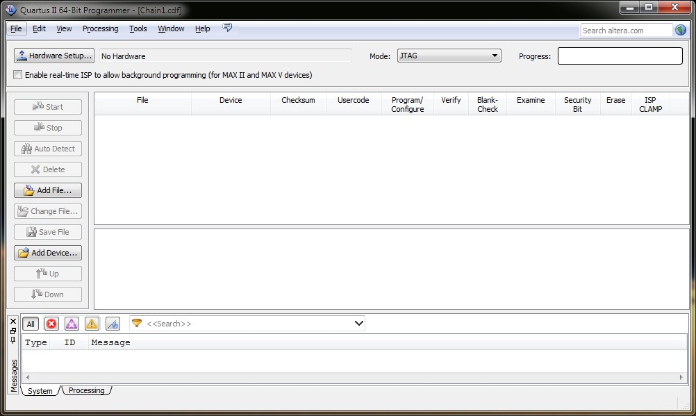
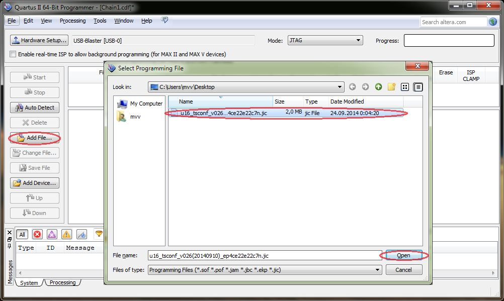
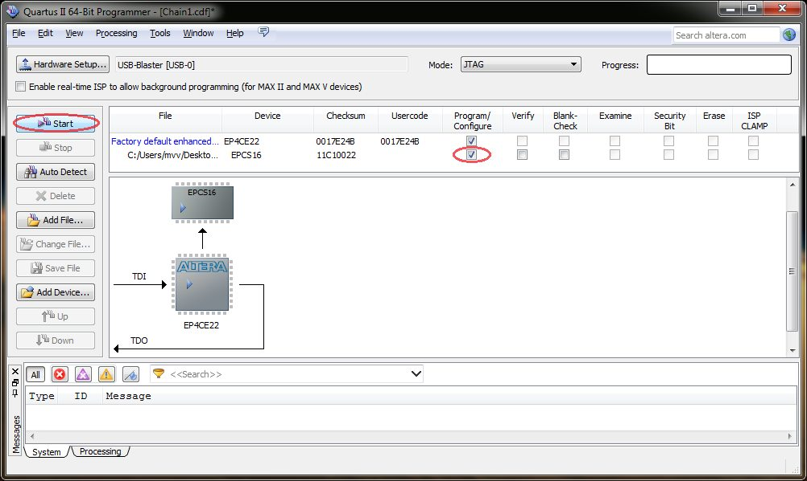
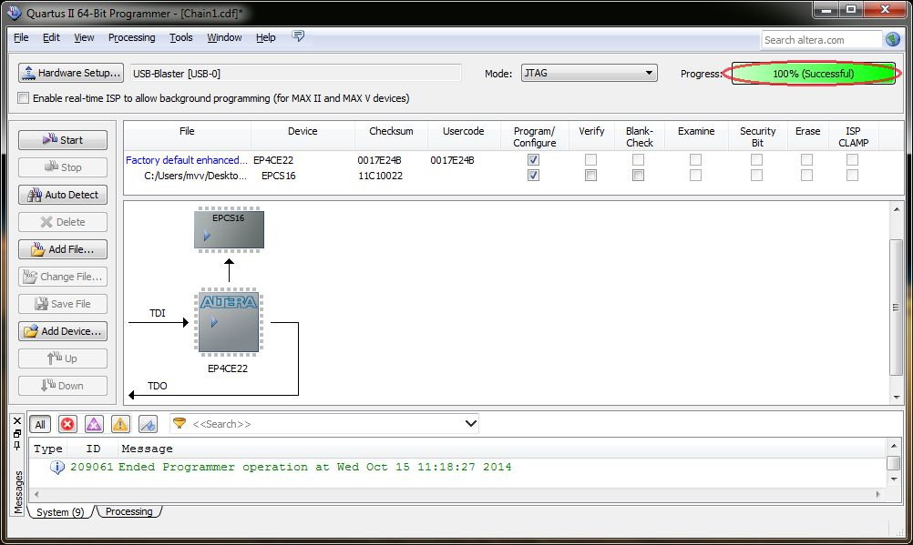
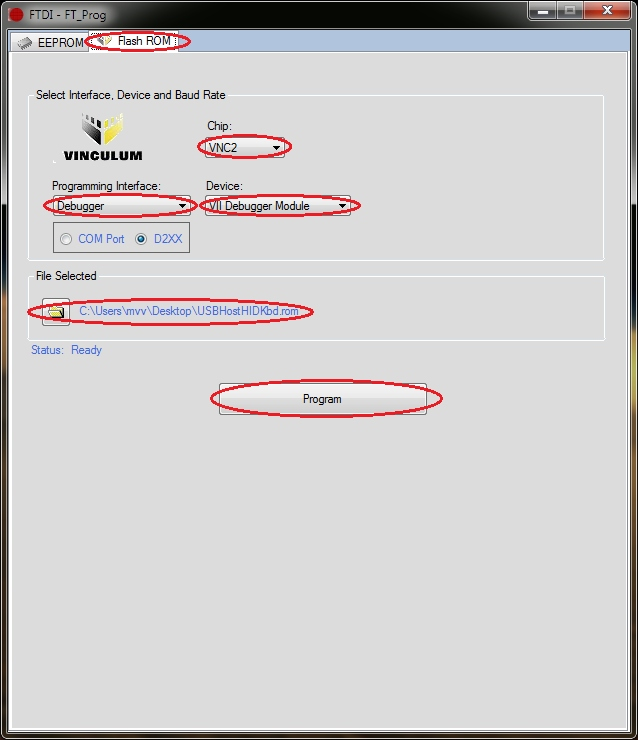
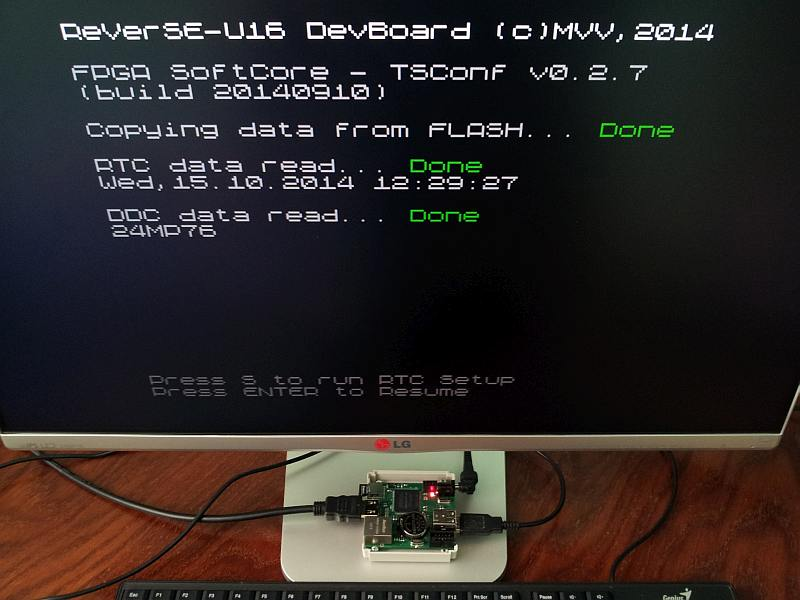
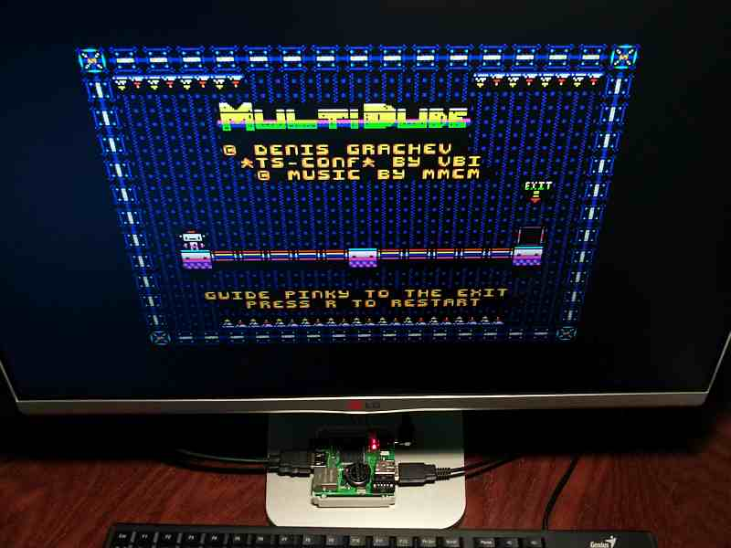

# TS-Conf

* Поддержка проекта: http://forum.tslabs.info/index.php
* Также тема обсуждения: http://zx-pk.ru/showthread.php?t=23528

## Установка TS-Conf:

1. Скачать и записать в корень на microSD (FAT32) файлы roms/zxevo.rom и WildCommander
2. Записать образы TRD, SCL, TAP, файлы поддерживающий WC...
3. Скачать и установить FTDI - FT_Prog или аналогичную утилиту для программирования VNC2
4. Скачать и установить Quartus Programmer
5. Подключить к плате ReVerSE-U16 (далее по тексту плата) блок питания, светодиод на плате должен засветится
6. Подключить программатор USB-Blaster и запрограммировать плату с помощью программы Quartus Programmer
7. 
8. 
9. 
10. 
11. 
12. Подключить к плате V2Debug Module и запрограммировать VNC2 с помощью программы FTDI - FT_Prog
13. 
14. Отключить блок питания и V2Debug Module
15. Подключить HDMI кабель, USB клавиатуру в нижний разъем USB и microSD
16. Включить монитор и блок питания платы
17. 
18. Press ENTER to continue
19. В Setup делаем нужные настройки и жмем F12
20. Попадаем в TR-DOS, т.к. диска нет он подвис в его ожидании, можно нажать Break (левый Shift + Space), появится строка приглашения для ввода команд (RETURN выход в BASIC), но нам это сейчас не нужно?
21. Жмем на левый Shift + F12, попадаем в WC (если не перенастраивали в Setup), можно нажать PrtScr для 49Hz
22. Выбираем курсорными клавишами нужный образ TRD, SCL, TAP и жмем на нем Enter
23. Монтируем его к примеру на Drive A, жмем Enter
24. Жмем F12 (сброс), попадаем в TR-DOS. Если на диске есть boot, то он автоматически стартует. Или CAT и RUN "файл"
25. При монтировании TAP, из BASIC набираем LOAD""...
26. 
